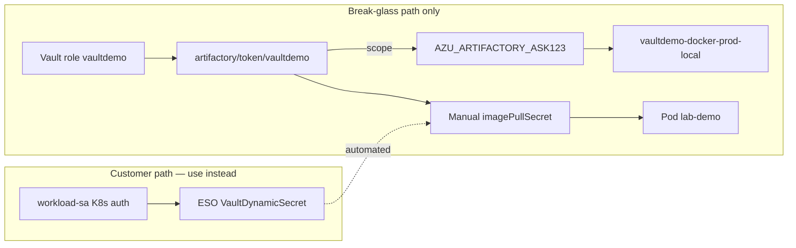

# Break-glass manual pull (debug only)

**Appendix — not the customer path.** The canonical automated flow is Phase 3 ESO: [../setup-and-validation.md](../setup-and-validation.md#phase-3--external-secrets-operator).

Manual procedure for pulling the lab Docker image using an operator-created `imagePullSecret` and Vault root token. Use only for debugging when ESO or K8s auth is misconfigured.

Validates **Vault → Artifactory token → `imagePullSecret` → prod repo pull → running pod** for app **ASK123**.

Full setup order: [../setup-and-validation.md](../setup-and-validation.md).

## Prerequisites

| Component | Requirement |
|-----------|-------------|
| Vault dev server | Running with plugin configured (`make start`, `make setup`, `make admin`) |
| Phase 1 complete | Group `AZU_ARTIFACTORY_ASK123`, prod repo, permission target, Vault role `vaultdemo` |
| Lab image in prod repo | `YOUR-TENANT.jfrog.io/vaultdemo-docker-prod-local/lab-demo:1.0.0` |
| Local Kubernetes | Rancher Desktop (k3s) or equivalent; `kubectl` working |
| Tools | `vault`, `kubectl`, `jq` |

Verify the cluster:

```bash
kubectl cluster-info
kubectl get nodes
```

Example (Rancher Desktop):

```
NAME                   STATUS   ROLES           VERSION
lima-rancher-desktop   Ready    control-plane   v1.34.5+k3s1
```

## End-to-end context



| Phase | Description | This break-glass test |
|-------|-------------|----------------------|
| Vault plugin → Artifactory token | Role `vaultdemo` issues scoped token | **Yes** |
| CMDB group `AZU_ARTIFACTORY_ASK123` | Per-app Artifactory group | **Yes** |
| Prod-only repo isolation | Pull from `vaultdemo-docker-prod-local` | **Yes** |
| Token → Docker registry auth | Token as registry password | **Yes** |
| Cluster → Artifactory pull | k3s/kubelet pulls OCI image | **Yes** — pod `lab-demo` |
| Vault Kubernetes auth | SA JWT → Vault policy | Use `./scripts/demo-kubernetes-auth.sh` |
| ESO automation | VaultDynamicSecret + ExternalSecret | Use `./scripts/demo-eso.sh` |

## Procedure

### 1. Issue a Vault Artifactory token

Use **one** `vault read` so `username` and `access_token` belong to the same token:

```bash
export VAULT_ADDR=http://127.0.0.1:8200
export VAULT_TOKEN=root

RESP=$(vault read -format=json artifactory/token/vaultdemo)
TOKEN_USERNAME=$(echo "$RESP" | jq -r '.data.username')
ACCESS_TOKEN=$(echo "$RESP" | jq -r '.data.access_token')

echo "username: ${TOKEN_USERNAME}"
echo "scope:    $(echo "$RESP" | jq -r '.data.scope')"
```

Expected scope: `applied-permissions/groups:AZU_ARTIFACTORY_ASK123`.

The `username` and `access_token` fields are used for Docker registry auth to `YOUR-TENANT.jfrog.io`.

### 2. Create namespace and pull secret

```bash
kubectl create namespace vaultdemo-ns --dry-run=client -o yaml | kubectl apply -f -

kubectl create secret docker-registry artifactory-pull \
  --namespace vaultdemo-ns \
  --docker-server=YOUR-TENANT.jfrog.io \
  --docker-username="${TOKEN_USERNAME}" \
  --docker-password="${ACCESS_TOKEN}" \
  --dry-run=client -o yaml | kubectl apply -f -
```

If the secret already exists, delete and recreate (tokens are single-use per username pairing).

**Important:** Use shell variables as shown. Do not paste placeholder text like `<token-username>` — zsh treats `<` as redirection.

### 3. Run a test pod

```bash
kubectl delete pod lab-demo -n vaultdemo-ns --ignore-not-found

kubectl run lab-demo \
  --namespace vaultdemo-ns \
  --image=YOUR-TENANT.jfrog.io/vaultdemo-docker-prod-local/lab-demo:1.0.0 \
  --overrides='{"spec":{"imagePullSecrets":[{"name":"artifactory-pull"}]}}' \
  --restart=Never \
  --command -- sh -c 'echo Successful Image Pull from Artifactory; sleep 3600'
```

### 4. Verify

Wait for the pod before reading logs (`ContainerCreating` is normal for a few seconds):

```bash
kubectl wait --for=condition=Ready pod/lab-demo -n vaultdemo-ns --timeout=120s
kubectl get pod lab-demo -n vaultdemo-ns
kubectl logs lab-demo -n vaultdemo-ns
```

**Expected:**

```
NAME       READY   STATUS    RESTARTS   AGE
lab-demo   1/1     Running   0          ...
Successful Image Pull from Artifactory
```

### Cold pull (optional)

If kubelet reports `already present on machine`, the image was cached in the cluster's containerd store. For a registry pull test:

```bash
kubectl delete pod lab-demo -n vaultdemo-ns
~/.rd/bin/nerdctl -n k8s.io rmi \
  YOUR-TENANT.jfrog.io/vaultdemo-docker-prod-local/lab-demo:1.0.0
# re-run kubectl run from step 3
```

## What this proves

1. **Vault role `vaultdemo` issues valid registry credentials** scoped to `AZU_ARTIFACTORY_ASK123`.
2. **Artifactory RBAC is correct** — ASK123 group can read prod repo only (see also `demo-isolation.sh`).
3. **Kubernetes `imagePullSecrets` work** with Vault-issued tokens — same mechanism customer Deployments use.
4. **Project-scoped prod images pull from JFrog Cloud** into local k3s.

Together with [demo-isolation.sh](../scripts/demo-isolation.sh), this closes **Vault → Artifactory → OCI pull → running container** for the ASK123 scenario.

## What this does not prove

| Gap | Use instead |
|-----|-------------|
| No human in the loop for credentials | `./scripts/demo-eso.sh` |
| ServiceAccount → Vault policy binding | `./scripts/demo-kubernetes-auth.sh` |
| Token refresh before lease expiry | ESO `refreshInterval: 1h` |
| Cross-namespace / cross-app denial | `./scripts/demo-isolation-multi-app.sh` |

## Troubleshooting

| Symptom | Likely cause |
|---------|--------------|
| `zsh: parse error near \n` on secret create | Placeholders pasted literally; use `${TOKEN_USERNAME}` and `${ACCESS_TOKEN}` |
| `BadRequest: ContainerCreating` on immediate `kubectl logs` | Pod not ready yet; use `kubectl wait` |
| Pod `ImagePullBackOff` / `401 Unauthorized` | Wrong scope on role; token expired; mismatched username/token from multiple `vault read` calls |
| Pod `ErrImagePull` / not found | Prod image not published; run prod publish or promote |
| `vault read` fails | Vault dev server not running; check `VAULT_ADDR` and `VAULT_TOKEN` |
| Scope shows wrong group | Re-run `./scripts/setup-phase1-vault.sh` |

Describe pull failures:

```bash
kubectl describe pod lab-demo -n vaultdemo-ns
```

## Cleanup

```bash
kubectl delete pod lab-demo -n vaultdemo-ns
kubectl delete secret artifactory-pull -n vaultdemo-ns
# optional:
kubectl delete namespace vaultdemo-ns
```

## Customer path (Phases 2–3)

| Break-glass (this doc) | Customer path |
|------------------------|---------------|
| Operator `vault read` with root token | `workload-sa` → Vault K8s auth → policy `vaultdemo-ask123-pull` |
| Manual `kubectl create secret` | ESO `ExternalSecret` → `kubernetes.io/dockerconfigjson` |
| — | **VaultDynamicSecret** generator — not KV `SecretStore.remoteRef` ([eso-vault-dynamic-secret.md](eso-vault-dynamic-secret.md)) |

## Related docs

- [../setup-and-validation.md](../setup-and-validation.md) — canonical runbook
- [eso-vault-dynamic-secret.md](eso-vault-dynamic-secret.md) — ESO integration detail
- [../visual-architecture.md](../visual-architecture.md) — architecture diagrams
