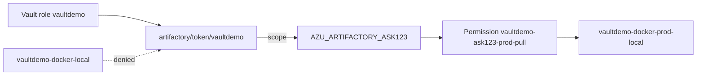

# Phase 1 provisioning (ASK123) — complete

CMDB application **ASK123**, JFrog project **`vaultdemo`**, Artifactory group **`AZU_ARTIFACTORY_ASK123`**.

**Status:** Phase 1 provisioned and validated (2026-06-22). Canonical runbook: [../setup-and-validation.md](../setup-and-validation.md).

**Entity diagram:** [../visual-architecture.md](../visual-architecture.md). **ASK123-only repo assets:** [../../assets/README.md](../../assets/README.md).

## Architecture



## Provisioned resources

### JFrog Platform

| Resource | Key / name | How created | Validated |
|----------|------------|-------------|-----------|
| Project | `vaultdemo` | MCP `jfrog_create_project` (earlier) | Yes |
| Dev Docker repo | `vaultdemo-docker-local` | MCP | Yes |
| Prod Docker repo | `vaultdemo-docker-prod-local` | MCP `jfrog_create_local_repository` | Yes |
| Group | `AZU_ARTIFACTORY_ASK123` | `POST /access/api/v2/groups` via `jf api` | Yes |
| Permission target | `vaultdemo-ask123-prod-pull` | MCP `jfrog_create_permission_target` | Yes |
| Image dev | `lab-demo:1.0.0` | `assets/publish.sh` | Yes |
| Image prod | `lab-demo:1.0.0` | `jf rt docker-promote` (or direct publish) | Yes |

### Production Docker repository

| Field | Value |
|-------|-------|
| Repository key | `vaultdemo-docker-prod-local` |
| Type | Local |
| Package type | Docker |
| Project | `vaultdemo` |
| Environment | PROD |
| URL | `https://YOUR-TENANT.jfrog.io/artifactory/vaultdemo-docker-prod-local` |
| Purpose | Production-ready OCI images for app ASK123 |

### Permission target

| Field | Value |
|-------|-------|
| Name | `vaultdemo-ask123-prod-pull` |
| Group | `AZU_ARTIFACTORY_ASK123` |
| Permission | **READ** on `vaultdemo-docker-prod-local` (`**`) |
| MCP tool | `jfrog_create_permission_target` |

Verify:

```bash
jf api /access/api/v2/permissions/vaultdemo-ask123-prod-pull --server-id "${JFROG_SERVER_ID}"
```

### Group creation API

MCP has no group-create tool. Create via Access API:

```bash
jf api /access/api/v2/groups --server-id "${JFROG_SERVER_ID}" \
  -X POST \
  -H "Content-Type: application/json" \
  -d '{
    "name": "AZU_ARTIFACTORY_ASK123",
    "description": "CMDB app ASK123 — Vault lab prod pull",
    "auto_join": false,
    "admin_privileges": false
  }'
```

Verify:

```bash
jf api /access/api/v2/groups/AZU_ARTIFACTORY_ASK123 --server-id "${JFROG_SERVER_ID}"
```

**Note:** Permission target creation failed on first MCP attempt because the group did not exist. Create the group first, then the permission target.

### Vault

| Resource | Name | Config |
|----------|------|--------|
| Plugin role | `vaultdemo` | `scope=applied-permissions/groups:AZU_ARTIFACTORY_ASK123`, TTL 1h / 3h |
| Policy | `vaultdemo-ask123-pull` | `read` on `artifactory/token/vaultdemo` |

Apply:

```bash
./scripts/setup-phase1-vault.sh
```

## Setup checklist (order)

| Step | Action | Script / command | Status |
|------|--------|------------------|--------|
| 1 | Create group `AZU_ARTIFACTORY_ASK123` | `jf api` (above) | Done |
| 2 | Create prod repo | MCP or UI | Done |
| 3 | Create permission target | MCP or UI | Done |
| 4 | Publish prod image | `DOCKER_REPO=vaultdemo-docker-prod-local ./assets/publish.sh` or `jf rt docker-promote` | Done |
| 5 | Vault role + policy | `./scripts/setup-phase1-vault.sh` | Done |
| 6 | Isolation tests | `./scripts/demo-isolation.sh` | Done |
| 7 | K8s smoke test (prod) | [break-glass-manual-pull.md](break-glass-manual-pull.md) | Superseded by ESO |

### Publish prod image

**Option A — direct publish (simplest for lab):**

```bash
DOCKER_REPO=vaultdemo-docker-prod-local ./assets/publish.sh
```

**Option B — promote from dev (CI-style):**

```bash
jf rt docker-promote lab-demo vaultdemo-docker-local vaultdemo-docker-prod-local \
  --source-tag=1.0.0 --copy=true --server-id "${JFROG_SERVER_ID}"
```

Verify:

```bash
jf rt curl -XGET \
  "/api/docker/vaultdemo-docker-prod-local/v2/lab-demo/tags/list" \
  --server-id "${JFROG_SERVER_ID}"
docker pull YOUR-TENANT.jfrog.io/vaultdemo-docker-prod-local/lab-demo:1.0.0
```

## Validation results (2026-06-22)

### `demo-isolation.sh`

```
scope:    applied-permissions/groups:AZU_ARTIFACTORY_ASK123
PASS: prod image pulled (YOUR-TENANT.jfrog.io/vaultdemo-docker-prod-local/lab-demo:1.0.0)
PASS: dev repo pull denied (YOUR-TENANT.jfrog.io/vaultdemo-docker-local/lab-demo:1.0.0)
```

### Kubernetes smoke test

- Namespace `vaultdemo-ns`, secret `artifactory-pull`, pod `lab-demo`
- Image: `YOUR-TENANT.jfrog.io/vaultdemo-docker-prod-local/lab-demo:1.0.0`
- Token: single `vault read -format=json artifactory/token/vaultdemo`
- Result: pod `Running`; log `Successful Image Pull from Artifactory`

## Lessons learned

| Issue | Cause | Fix |
|-------|-------|-----|
| Role scope `readers` instead of ASK123 | `.env` `ARTIFACTORY_SCOPE=readers` overridden Phase 1 script | `setup-phase1-vault.sh` now uses `PHASE1_SCOPE` from `ASK_ID` |
| Docker `Wrong username was used` | Multiple `vault read` calls minted mismatched username/token pairs | Single `vault read -format=json`; use `demo-isolation.sh` |
| Storage API 403/404 on `manifest.json` | Docker images use `list.manifest.json`; Bearer vs Basic auth differs | Use `docker pull` or Docker Registry v2 API for validation |
| `jf rt curl` 404 on Access API | Wrong CLI target URL | Use `jf api` for `/access/api/...` |

## MCP tool gaps (Experimental server)

| Need | MCP support |
|------|-------------|
| Create project | Yes — `jfrog_create_project` |
| Create local Docker repo | Yes — `jfrog_create_local_repository` |
| Create permission target | Yes — `jfrog_create_permission_target` (group must exist) |
| Create group | **No** — use `jf api` |
| Publish / promote Docker image | **No** — use CLI or `assets/publish.sh` |
| Vault role / policy | **No** — use `setup-phase1-vault.sh` |

## Related docs

- [../setup-and-validation.md](../setup-and-validation.md) — canonical runbook
- [lab-provisioned-assets.md](lab-provisioned-assets.md) — extended inventory
- [break-glass-manual-pull.md](break-glass-manual-pull.md) — debug-only manual pull
- [lab-log.md](lab-log.md) — chronological history
