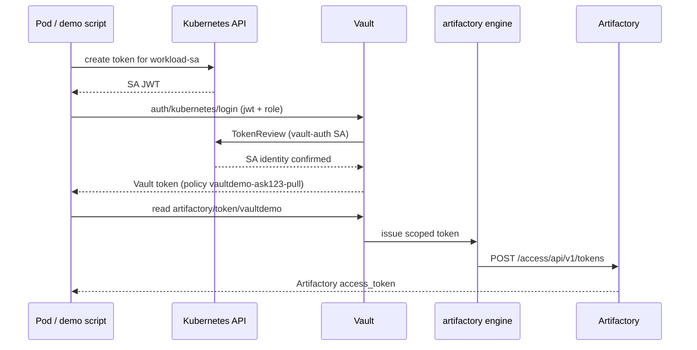

# Phase 2 — Vault Kubernetes auth

Bind a Kubernetes service account in `vaultdemo-ns` to Vault policy `vaultdemo-ask123-pull`, so workloads can obtain `artifactory/token/vaultdemo` **without** the Vault root token.

**Status:** Implemented via `scripts/setup-kubernetes-auth.sh` and `scripts/demo-kubernetes-auth.sh`.

Full lab setup order: [../setup-and-validation.md](../setup-and-validation.md).

**Runtime sequence diagram:** [../visual-architecture.md#runtime-sequence-automated-eso-path](../visual-architecture.md#runtime-sequence-automated-eso-path)

## Architecture



| Component | Value |
|-----------|-------|
| Namespace | `vaultdemo-ns` |
| Workload SA | `workload-sa` |
| Vault auth path | `auth/kubernetes` |
| Vault auth role | `vaultdemo-workload` |
| Vault policy | `vaultdemo-ask123-pull` |
| Token reviewer SA | `kube-system/vault-auth` |
| ClusterRoleBinding | `vault-auth-delegator` → `system:auth-delegator` |

Operational detail (env vars, TTLs, validation scope, re-runs): [phase2-kubernetes-auth-notes.md](phase2-kubernetes-auth-notes.md).

| Requirement | Notes |
|-------------|-------|
| Phase 1 complete | `./scripts/setup-phase1-vault.sh` |
| Vault dev server | `http://127.0.0.1:8200` on host |
| kubectl | Rancher Desktop k3s (API `https://127.0.0.1:6443`) |
| `jq` | Required by setup and demo scripts |
| Vault reachable from host | Default lab layout |

Vault runs **on the Mac host**, not inside the cluster. The Kubernetes API URL from `kubectl config` (`127.0.0.1:6443`) must be reachable from the Vault process.

## Setup

```bash
cd vault-artifactory-lab
source .env

./scripts/setup-kubernetes-auth.sh
```

The script:

1. Creates namespace `vaultdemo-ns` and SA `workload-sa`
2. Creates `kube-system/vault-auth` + `ClusterRoleBinding` to `system:auth-delegator`
3. Enables `auth/kubernetes` on Vault
4. Configures Kubernetes API host, CA cert, and token reviewer JWT
5. Creates role `vaultdemo-workload` bound to `workload-sa` in `vaultdemo-ns` → policy `vaultdemo-ask123-pull`

## Validation

```bash
./scripts/demo-kubernetes-auth.sh
```

**Expected:**

- PASS: SA JWT issued
- PASS: Vault login succeeded (policies include `vaultdemo-ask123-pull`)
- PASS: Artifactory token scope includes `AZU_ARTIFACTORY_ASK123`
- PASS: `artifactory/config/admin` denied for workload token

Validation runs from the **host** (CLI simulates SA JWT → Vault login). See [phase2-kubernetes-auth-notes.md](phase2-kubernetes-auth-notes.md#validation-scope) for scope and limitations.

Manual equivalent:

```bash
JWT=$(kubectl create token workload-sa -n vaultdemo-ns --duration=1h)
vault write auth/kubernetes/login role=vaultdemo-workload jwt="$JWT"

# Use returned client_token:
export VAULT_TOKEN=<client_token>
vault read artifactory/token/vaultdemo
```

## Customer mapping

From [internal/customer-requirements.md](../internal/customer-requirements.md):

- **K8s service account** in namespace → Vault Kubernetes auth role
- **Vault policy** allows only `artifactory/token/vaultdemo` (per project/ASK ID)
- **Plugin role** `vaultdemo` → scope `AZU_ARTIFACTORY_ASK123`
- Phase 3 (ESO) uses **VaultDynamicSecret** + K8s auth — not KV `SecretStore`. See [eso-vault-dynamic-secret.md](eso-vault-dynamic-secret.md).

## Troubleshooting

| Symptom | Likely cause | Fix |
|---------|--------------|-----|
| `permission denied` on login | Role binding mismatch | Check SA name/namespace vs `vault read auth/kubernetes/role/vaultdemo-workload` |
| `service account name not authorized` | Wrong JWT or SA | Use JWT from `workload-sa` in `vaultdemo-ns` |
| Vault cannot reach API | Wrong `kubernetes_host` | Re-run setup; confirm `https://127.0.0.1:6443` from host |
| Login works then `permission denied` on token read | Phase 1 policy missing | Re-run `./scripts/setup-phase1-vault.sh` |
| Reviewer JWT expired (long-running lab) | Reviewer token TTL | Re-run `./scripts/setup-kubernetes-auth.sh` |

## Cleanup

```bash
vault auth disable kubernetes   # removes auth/kubernetes
kubectl delete sa workload-sa -n vaultdemo-ns
kubectl delete sa vault-auth -n kube-system
kubectl delete clusterrolebinding vault-auth-delegator
```

## Next phase

**Phase 3 — External Secrets Operator:** `VaultDynamicSecret` (GET `artifactory/token/vaultdemo`) + `ExternalSecret` → `kubernetes.io/dockerconfigjson`. Not the KV-only `SecretStore` pattern — see [phase3-eso-plan.md](phase3-eso-plan.md).

## Related docs

- [phase1-provisioning-history.md](phase1-provisioning-history.md) — ASK123 RBAC history (prerequisite)
- [break-glass-manual-pull.md](break-glass-manual-pull.md) — debug-only manual imagePullSecret
- [phase2-kubernetes-auth-notes.md](phase2-kubernetes-auth-notes.md) — env vars, TTLs, validation scope
