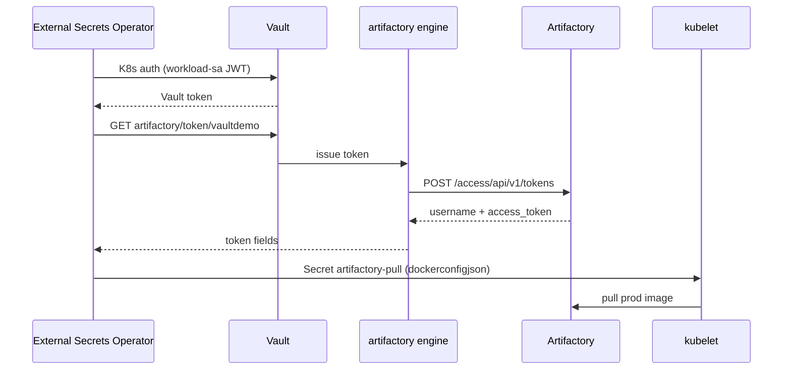

# Phase 3 — External Secrets Operator (complete)

Automate the Docker pull secret: **External Secrets Operator (ESO)** syncs Vault-issued Artifactory credentials into `kubernetes.io/dockerconfigjson` for `imagePullSecrets`.

**Status:** Implemented — `scripts/setup-eso.sh`, `scripts/demo-eso.sh`, `k8s/eso/`.

Prerequisites: Phase 1 and [phase2-kubernetes-auth.md](phase2-kubernetes-auth.md). ESO integration detail: [eso-vault-dynamic-secret.md](eso-vault-dynamic-secret.md).

**Full ESO runtime sequence diagram:** [../visual-architecture.md#runtime-sequence-automated-eso-path](../visual-architecture.md#runtime-sequence-automated-eso-path)

Canonical runbook: [../setup-and-validation.md](../setup-and-validation.md).

---

## Goal

Automate Docker pull secrets via ESO, replacing the break-glass manual path ([break-glass-manual-pull.md](break-glass-manual-pull.md)).

| Before | After Phase 3 |
|--------|----------------|
| Operator `vault read artifactory/token/vaultdemo` | ESO reads Vault in-cluster |
| `kubectl create secret docker-registry …` | ESO creates/updates `artifactory-pull` |
| Manual refresh on lease expiry | `refreshInterval: 1h` on ExternalSecret |

Image: `YOUR-TENANT.jfrog.io/vaultdemo-docker-prod-local/lab-demo:1.0.0`.

---

## Architecture



| Component | Lab value |
|-----------|-----------|
| ESO namespace | `external-secrets` |
| Workload namespace | `vaultdemo-ns` |
| VaultDynamicSecret | `artifactory-vaultdemo-token` |
| ExternalSecret | `artifactory-pull` |
| Synced secret | `artifactory-pull` |
| Vault URL (from cluster) | `http://host.docker.internal:8200` |
| Test pod | `lab-demo-eso` |

---

## Setup

```bash
cd vault-artifactory-lab
source .env

# Vault dev server running; plugin + Phase 1/2 configured
./scripts/setup-phase1-vault.sh
./scripts/setup-kubernetes-auth.sh
./scripts/setup-eso.sh
```

`setup-eso.sh`:

1. Installs ESO via Helm (if missing)
2. Applies `k8s/eso/vault-dynamic-secret.yaml` and `external-secret.yaml` (via `envsubst`)
3. Deletes any manual `artifactory-pull` secret so ESO owns it

---

## Validation

```bash
./scripts/demo-eso.sh
```

**Expected (validated 2026-07-06):**

```
PASS: ExternalSecret artifactory-pull is Ready
PASS: secret type is kubernetes.io/dockerconfigjson
PASS: dockerconfigjson contains registry YOUR-TENANT.jfrog.io username
PASS: pod pulled and ran prod image
Successful Image Pull from Artifactory
```

---

## Customer mapping

From [internal/customer-requirements.md](../internal/customer-requirements.md) (customer notes — lab answers here):

| Customer question | Lab answer |
|-------------------|------------|
| SA → Vault policy? | Phase 2: `workload-sa` → `vaultdemo-workload` → `vaultdemo-ask123-pull` |
| ESO SecretStore chain? | **VaultDynamicSecret** uses same SA JWT + K8s auth (not KV SecretStore) |
| `remoteRef.key` → role? | Target **`artifactory/token/vaultdemo`** (token path), not `artifactory/roles/…` |
| Deployment `imagePullSecrets`? | References ESO-synced secret `artifactory-pull` |

---

## Troubleshooting

| Symptom | Likely cause | Fix |
|---------|--------------|-----|
| ExternalSecret `SecretSyncedError` | Vault unreachable from cluster | Confirm `http://host.docker.internal:8200/v1/sys/health` from a pod |
| `Token failed verification: revoked` | Plugin admin token expired | Refresh: `jf atc --grant-admin …` then `vault write artifactory/config/admin …` |
| Vault restart wiped config | Dev server is in-memory | Re-run plugin setup + Phase 1/2/3 |
| `unknown field … audiences` | VaultDynamicSecret CRD has no audiences | Removed from lab manifest (see notes doc) |

---

## Related docs

- [eso-vault-dynamic-secret.md](eso-vault-dynamic-secret.md) — VaultDynamicSecret vs KV SecretStore
- [phase2-kubernetes-auth.md](phase2-kubernetes-auth.md) — prerequisite
- [../setup-and-validation.md](../setup-and-validation.md) — canonical runbook
