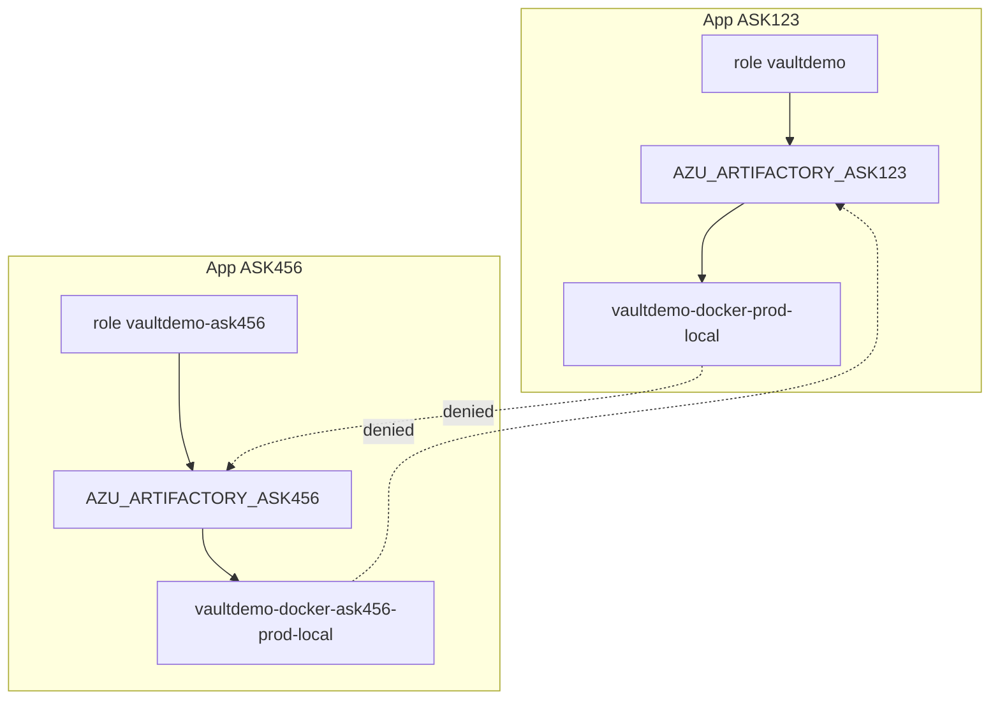

# Phase 4 — Multi-app isolation (complete)

Prove **two CMDB apps** (ASK123 and ASK456) are isolated: each Vault role → Artifactory group → dedicated prod repo only; cross-app pulls denied.

**Status:** Implemented — `scripts/setup-phase4-*.sh`, `scripts/demo-isolation-multi-app.sh`.

Prerequisites: Phases 1–3 complete.

Full lab order: [../setup-and-validation.md](../setup-and-validation.md).

**Multi-app isolation diagrams:** [../visual-architecture.md#multi-app-isolation](../visual-architecture.md#multi-app-isolation)

---

## Architecture



| App | CMDB ID | Vault role | Policy | Prod repo | Image |
|-----|---------|------------|--------|-----------|-------|
| ASK123 | ASK123 | `vaultdemo` | `vaultdemo-ask123-pull` | `vaultdemo-docker-prod-local` | `lab-demo:1.0.0` |
| ASK456 | ASK456 | `vaultdemo-ask456` | `vaultdemo-ask456-pull` | `vaultdemo-docker-ask456-prod-local` | `lab-demo-ask456:1.0.0` |

Each app has its own Kubernetes namespace for Phase 4 auth tests:

| App | Namespace | K8s auth role |
|-----|-----------|---------------|
| ASK123 | `vaultdemo-ns` | `vaultdemo-workload` |
| ASK456 | `vaultdemo-ask456-ns` | `vaultdemo-ask456-workload` |

---

## Setup

```bash
cd vault-artifactory-lab
source .env

./scripts/setup-phase4-artifactory.sh   # group, repo, permission, image
./scripts/setup-phase4-vault.sh         # role, policy, K8s auth role
```

---

## Validation

```bash
./scripts/demo-isolation-multi-app.sh
```

**Expected:**

- ASK123 token pulls ASK123 prod repo; denied on ASK456 prod repo
- ASK456 token pulls ASK456 prod repo; denied on ASK123 prod repo
- ASK456 SA Vault token can read `artifactory/token/vaultdemo-ask456` only (not `vaultdemo`)

---

## Related docs

- [phase1-provisioning-history.md](phase1-provisioning-history.md) — ASK123 baseline
- [eso-vault-dynamic-secret.md](eso-vault-dynamic-secret.md) — ESO (ASK123 namespace)
