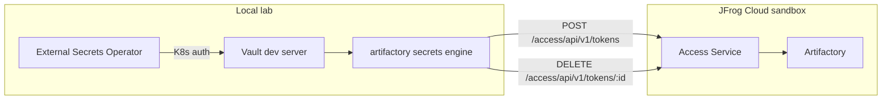
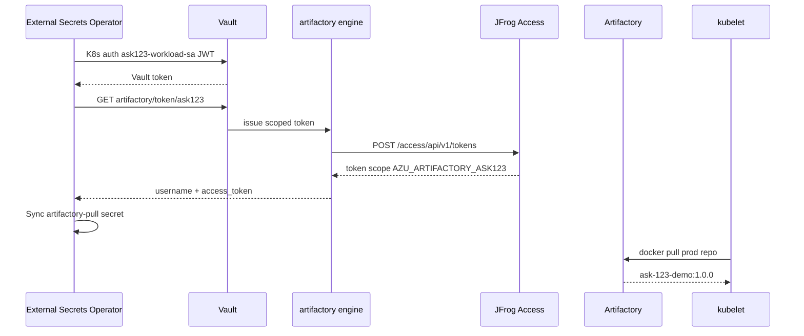

# Architecture

**Visual reference (ERD + sequence diagrams):** [visual-architecture.md](visual-architecture.md)

**Setup runbook:** [setup-and-validation.md](setup-and-validation.md)

## Overview

## Components

| Component | Location | Notes |
|-----------|----------|-------|
| Vault | Local (`vault server -dev`) | Demo only — not for production |
| Plugin binary | Pre-built from [GitHub releases](https://github.com/jfrog/vault-plugin-secrets-artifactory/releases) | Installed to `.vault-plugin/` by `download-plugin.sh` |
| Artifactory | JFrog Cloud sandbox | Requires admin-scoped bootstrap token |
| ESO | `external-secrets` namespace | VaultDynamicSecret + ExternalSecret |

## Key plugin paths

| Path | Purpose |
|------|---------|
| `artifactory/config/admin` | Artifactory URL + admin token |
| `artifactory/config/rotate` | Rotate admin token (recommended after bootstrap) — see [admin-token-bootstrap-rotation.md](admin-token-bootstrap-rotation.md) |
| `artifactory/roles/:name` | Role definitions (scope, TTL) |
| `artifactory/token/:role` | Issue scoped access tokens (dynamic read) |

The `artifactory/` mount is a **plugin secrets engine** (dynamic credentials), not Vault KV. Use **VaultDynamicSecret** + `ExternalSecret.dataFrom.generatorRef` — see [setup-and-validation.md](setup-and-validation.md) Phase 3.

## Customer pull flow (ESO path)

Full sequence: [visual-architecture.md#runtime-sequence-automated-eso-path](visual-architecture.md#runtime-sequence-automated-eso-path).

## Entity model (three binding layers)

Each CMDB application is wired through **three independent bindings**:

| Layer | Binds | Lab example (ASK123) |
|-------|-------|----------------------|
| 1 — Artifactory RBAC | CMDB → group → permission → prod repo | `ASK123` → `AZU_ARTIFACTORY_ASK123` → READ on `ask123-docker-prod-local` |
| 2 — Vault | CMDB → plugin role (scope = group) → policy → token path | `ask123` role → `ask123-pull` → `artifactory/token/ask123` |
| 3 — Kubernetes | SA → K8s auth role → policy; ESO → pull secret → pod | `ask123-workload-sa` → `ask123-workload` → ESO `ExternalSecret` → `artifactory-pull` |

Phase 4 repeats layers 1–3 for **ASK456**. Cross-app pulls denied at Artifactory permission targets and Vault policy boundaries.

## ESO integration

ESO cannot use a Vault **SecretStore** with KV `remoteRef` against `artifactory/`. Use **VaultDynamicSecret** + `ExternalSecret.dataFrom.generatorRef` targeting `artifactory/token/ask123`.

## Official reference

- [JFrog HashiCorp Integrations](https://docs.jfrog.com/integrations/docs/hashicorp-integrations)
- Doc corrections: [appendix/jfrog-doc-corrections.md](appendix/jfrog-doc-corrections.md)

## Version requirements

| Feature | Min Artifactory |
|---------|-----------------|
| Non-expiring admin tokens | 7.42.1 |
| `use_expiring_tokens` | 7.50.3 |
| Token rotation (reliable revoke) | 7.42.1 |
| Modern scope syntax (`applied-permissions/groups:…`) | 7.21.1 |
