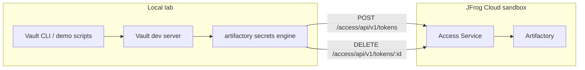

# Architecture

## Overview

## Components

| Component | Location | Notes |
|-----------|----------|-------|
| Vault | Local (`vault server -dev`) | Demo only — not for production |
| Plugin binary | Built from `vault-plugin-secrets-artifactory` | Registered in Vault plugin catalog |
| Artifactory | JFrog Cloud sandbox | Requires admin-scoped bootstrap token |

## Key plugin paths

| Path | Purpose |
|------|---------|
| `artifactory/config/admin` | Artifactory URL + admin token |
| `artifactory/config/rotate` | Rotate admin token (recommended after bootstrap) |
| `artifactory/roles/:name` | Role definitions (scope, TTL) |
| `artifactory/token/:role` | Issue scoped access tokens |
| `artifactory/user_token/:user` | Per-user tokens (optional demo) |

## Version requirements

| Feature | Min Artifactory |
|---------|-----------------|
| Non-expiring admin tokens | 7.42.1 |
| `use_expiring_tokens` | 7.50.3 |
| Token rotation (reliable revoke) | 7.42.1 |
