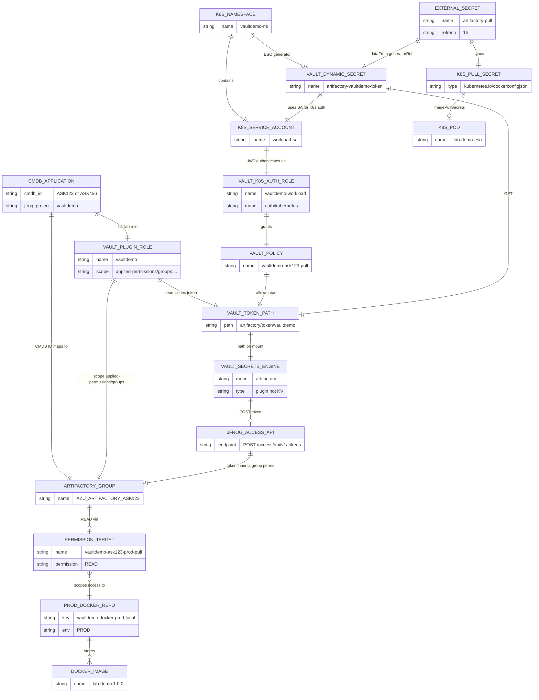
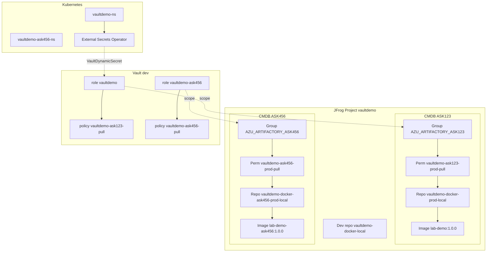
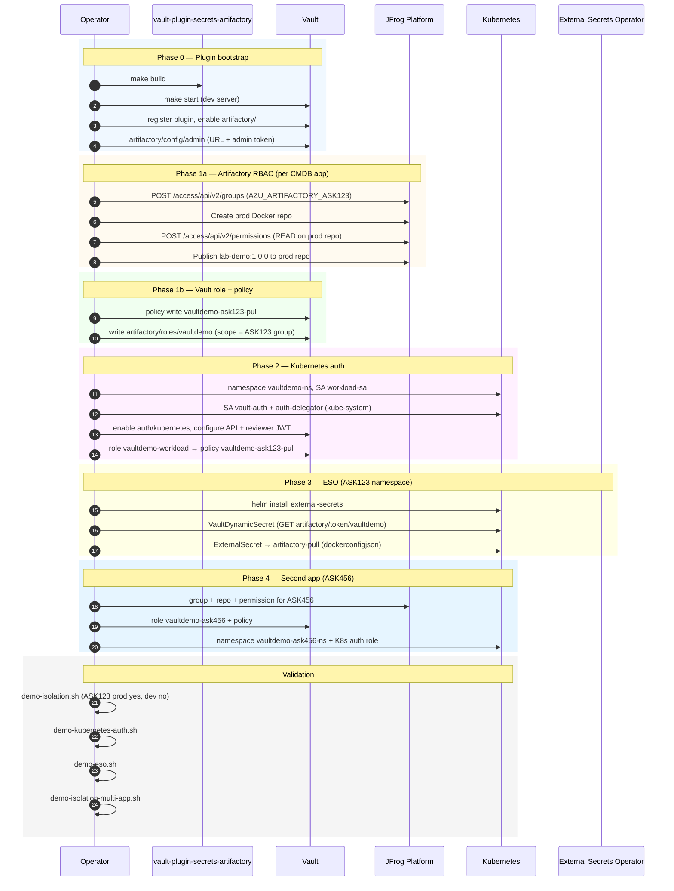
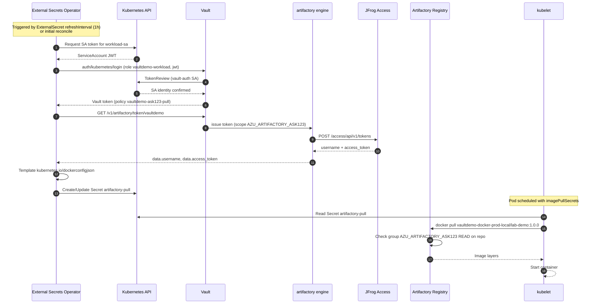
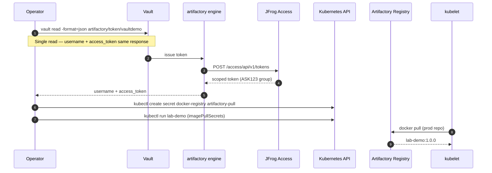
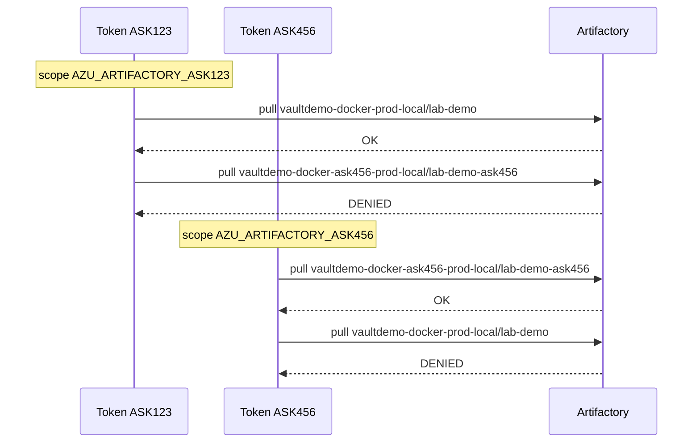
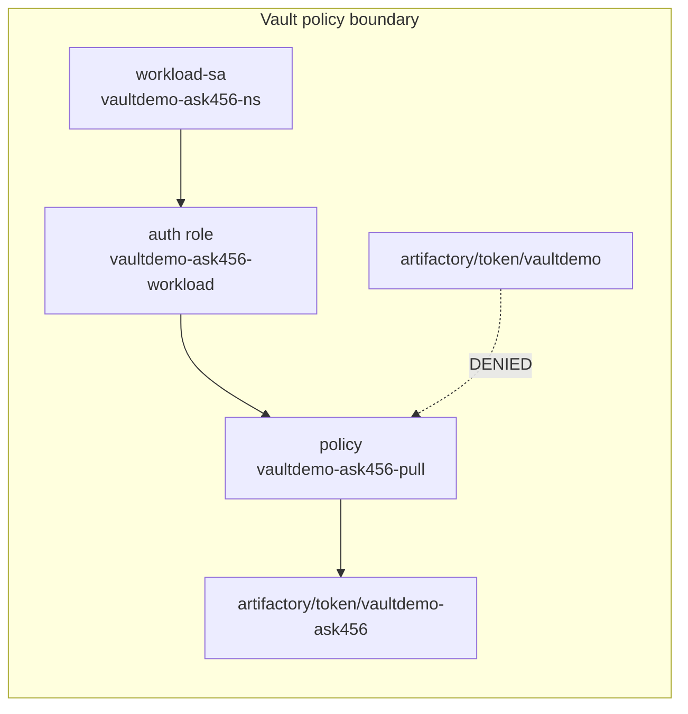
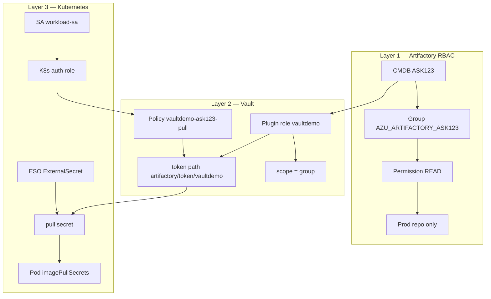

# Visual architecture (Mermaid)

Visual reference for the Vault ↔ Artifactory lab: **entity relationships**, **setup order**, and **runtime flows**.

Validated on JFrog Cloud, local Vault dev, Rancher Desktop k3s, Phases 0–4.

| Diagram | Use when |
|---------|----------|
| [Entity relationship](#entity-relationship-diagram) | Understanding *what connects to what* (CMDB → group → repo → Vault → K8s) |
| [Setup sequence](#setup-order-sequence-diagram) | Provisioning a new app or reproducing the lab |
| [Runtime ESO sequence](#runtime-sequence-automated-eso-path) | Explaining the automated pull-credential chain |
| [Runtime manual sequence](#appendix-break-glass-manual-pull) | Debug only — operator-held root token |
| [Multi-app isolation](#multi-app-isolation) | Why ASK123 cannot pull ASK456 (and vice versa) |

Related: [setup-and-validation.md](setup-and-validation.md), [architecture.md](architecture.md), [appendix/](appendix/).

---

## Key findings (lab-validated)

| Finding | Implication |
|---------|-------------|
| `artifactory/` is a **plugin secrets engine** | Dynamic token issue on read — **not** Vault KV |
| ESO Vault **SecretStore** is KV-only | Use **VaultDynamicSecret** + `ExternalSecret.dataFrom.generatorRef` for `artifactory/token/…` |
| Token path vs role path | **`artifactory/token/vaultdemo`** issues credentials; **`artifactory/roles/vaultdemo`** is config only |
| One `vault read` per Docker login | Username + `access_token` must come from the **same** response |
| Phase 1 scope | `setup-phase1-vault.sh` derives scope from `ASK_ID` |
| Vault from cluster | `http://host.docker.internal:8200` (Rancher Desktop) |
| Permission target create | `POST /access/api/v2/permissions` with `name` in body (not `POST …/permissions/{name}`) |
| Per-app isolation | Separate group + permission target + prod repo + Vault role + policy + K8s auth role |

---

## Entity relationship diagram

Shows **one CMDB application** (pattern repeats for ASK123 and ASK456). Solid lines are direct bindings; dashed lines are runtime/issue flows.

### Lab instances (two apps)

---

## Setup order sequence diagram

Order of operations to provision **one app** (ASK123). Repeat Artifactory + Vault + K8s auth blocks for ASK456 (Phase 4). ESO is optional per namespace (Phase 3, ASK123 only in lab).

---

## Runtime sequence (automated ESO path)

Full **customer target** flow: no human `vault read`; ESO syncs pull secret before kubelet pulls.

---

## Appendix: break-glass manual pull

Debug-only path: operator creates pull secret with Vault root token. **Not the customer path** — use Phase 3 ESO instead. Full procedure: [appendix/break-glass-manual-pull.md](appendix/break-glass-manual-pull.md).

## Runtime sequence (manual — debug only)

Same RBAC outcome without ESO — operator holds Vault root token.

---

## Multi-app isolation

Cross-app denial is enforced at **three layers**: Artifactory permission targets, Vault policies, and scoped plugin tokens.

---

## Three binding layers (customer model)

The customer scenario chains **three independent bindings**. The ER diagram above maps to this summary:

---

## Script ↔ phase map

| Phase | Setup script | Validation script |
|-------|--------------|-------------------|
| 0 | `setup-vault.sh` / plugin `make setup` | `vault read artifactory/config/admin` |
| 1a–1e | Artifactory `jf api` / `publish.sh`, `setup-phase1-vault.sh` | `docker pull` prod, `vault read artifactory/roles/vaultdemo` |
| 1f | — | `demo-isolation.sh` (optional Layer 1) |
| 2 | `setup-kubernetes-auth.sh` | `demo-kubernetes-auth.sh` |
| 3 | `setup-eso.sh` | `demo-eso.sh` (primary) |
| 4 | `setup-phase4-artifactory.sh`, `setup-phase4-vault.sh` | `demo-isolation-multi-app.sh` |

---

## Related docs

- [setup-and-validation.md](setup-and-validation.md) — canonical runbook
- [appendix/eso-vault-dynamic-secret.md](appendix/eso-vault-dynamic-secret.md) — VaultDynamicSecret vs KV SecretStore
- [appendix/phase4-multi-app-isolation.md](appendix/phase4-multi-app-isolation.md) — ASK456 details
