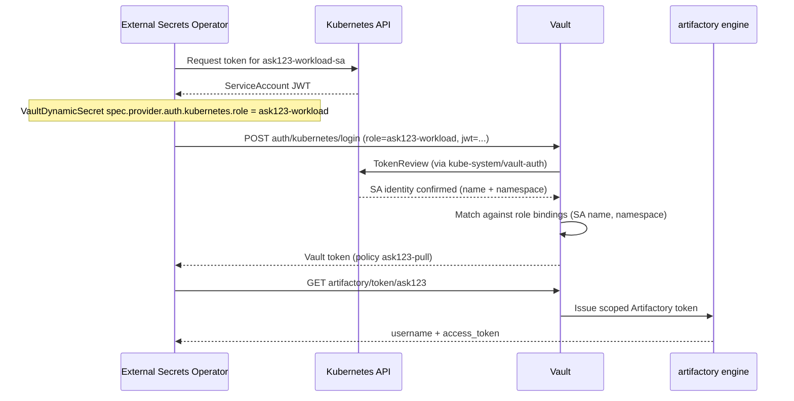

# Follow-up questions — draft responses

Responses to the questions in `internal/customer-follow-up-questions.txt`, based on the lab implementation, JFrog Vault plugin behavior, and HashiCorp Vault Kubernetes auth. Items marked **lab-validated** were exercised in this repo; items marked **design guidance** are architectural recommendations not fully load-tested here.

---

## Context on your first impressions

**Namespace granularity via service account → Artifactory group:** **Lab-validated.** Each CMDB application (ASK123, ASK456) gets its own Kubernetes namespace, workload service account, Vault Kubernetes auth role, Vault policy, plugin role (scoped to an Artifactory group), and prod-repo permission target. Cross-app pulls are denied at both Artifactory and Vault policy boundaries.

**Cloud / runtime neutrality:** **Design guidance, consistent with the lab.** The flow uses standard Kubernetes (ServiceAccount, ESO), Vault (Kubernetes auth + secrets engine), and JFrog Access/Artifactory APIs. Nothing in the lab is Azure-, AWS-, or GCP-specific. Any managed Kubernetes that supports service account token projection and can reach Vault and Artifactory should work the same way.

**Performance / load / scalability:** **Not lab-tested.** This repo proves functional correctness for a small number of apps and namespaces on a single **Kubernetes cluster**. Production sizing would need discussion with HashiCorp and JFrog on Vault request rates, ESO reconcile intervals, Artifactory token issuance, and whether token TTL/refresh patterns meet peak pull volume. Worth a dedicated conversation; the architecture does not inherently require one Vault cluster or one ESO per namespace.

---

## 1. Can a single Vault cluster support many Kubernetes clusters accessing it for this purpose?

**Yes, in principle — with one Kubernetes auth mount per Kubernetes cluster (design guidance).**

Vault’s Kubernetes auth method is configured **per mount** with that **Kubernetes cluster’s** API server URL, CA certificate, and a token reviewer JWT. A single **Vault cluster** commonly serves many **Kubernetes clusters** by enabling **separate auth paths**, for example:

- `auth/kubernetes/prod-east`
- `auth/kubernetes/prod-west`

Each mount gets its own `config` (**Kubernetes cluster** API endpoint + reviewer) and its own set of **roles**. Workloads in **Kubernetes cluster A** authenticate only against the mount configured for **Kubernetes cluster A**.

**Lab-validated:** one **Kubernetes cluster**, one mount (`auth/kubernetes`).

**Not lab-validated:** one **Vault cluster** serving multiple **Kubernetes clusters**, each with its own Kubernetes auth mount. HashiCorp documents this pattern ([Kubernetes auth method](https://developer.hashicorp.com/vault/docs/auth/kubernetes), [auth methods — multiple mounts](https://developer.hashicorp.com/vault/docs/auth), [multi-cluster naming tutorial](https://developer.hashicorp.com/vault/tutorials/kubernetes/policy-templates-kubernetes)); we have not run it in this lab. See [External references](docs/setup-and-validation.md#external-references) in the runbook for the full link list.

Operational requirements when one **Vault cluster** serves many **Kubernetes clusters**:

- Network: every **Kubernetes cluster’s** nodes/pods (ESO) must reach the **Vault cluster**.
- Each **Kubernetes cluster** needs a `vault-auth` (or equivalent) reviewer service account with [`system:auth-delegator`](https://kubernetes.io/docs/reference/access-authn-authz/rbac/#user-facing-roles) ([Vault Kubernetes auth — TokenReview](https://developer.hashicorp.com/vault/docs/auth/kubernetes)).
- ESO `VaultDynamicSecret` must point at the correct **Vault cluster** URL **and** the correct Kubernetes auth mount path + role for that **Kubernetes cluster**.

---

## 2. If a single Vault cluster is used, are there concerns if `mygreatnamespace` is used by App A in Kubernetes cluster c1 and by App B in Kubernetes cluster c2?

**The namespace name alone is not a global identity across Kubernetes clusters — but Vault Kubernetes auth role design must account for collision (design guidance).**

A ServiceAccount JWT is validated by **the Kubernetes API server of the Kubernetes cluster that issued it** ([Kubernetes authentication](https://kubernetes.io/docs/reference/access-authn-authz/authentication/), [TokenReview API](https://kubernetes.io/docs/reference/kubernetes-api/definitions/token-review-v1-authentication/)). Vault checks:

- JWT signature / [TokenReview](https://developer.hashicorp.com/vault/docs/auth/kubernetes) against **that Kubernetes cluster** (via the auth mount `config` for that Kubernetes cluster)
- [`bound_service_account_names`](https://developer.hashicorp.com/vault/api-docs/auth/kubernetes#create-role) and `bound_service_account_namespaces` on the **Vault Kubernetes auth role**

So `mygreatnamespace` on **Kubernetes cluster c1** and `mygreatnamespace` on **Kubernetes cluster c2** are **different identities** if you use **separate Kubernetes auth mounts** (one per Kubernetes cluster). App A’s role on the c1 mount binds `mygreatnamespace` + App A’s SA; App B’s role on the c2 mount binds `mygreatnamespace` + App B’s SA — no conflict.

**Concerns arise if:**

| Risk | Mitigation |
|------|------------|
| Same Kubernetes auth mount used for multiple Kubernetes clusters (misconfiguration) | One mount = one Kubernetes cluster API; do not reuse |
| Ambiguous Vault Kubernetes auth role names across Kubernetes clusters | Include Kubernetes cluster (or environment) in role names, e.g. `ask123-c1-workload` |
| Same CMDB app, same namespace name, different Kubernetes clusters | Bind by **CMDB / ASK ID**, not namespace string alone; use distinct Vault roles per Kubernetes cluster if policies differ |
| Vault policy assumes namespace name is globally unique | Prefer **CMDB app ID** (ASK123) as the stable key in Vault role names, plugin roles, and Artifactory groups |

**Lab-validated:** two apps, two namespaces (`ask123-ns`, `ask456-ns`), one **Kubernetes cluster** — no cross-app access.

**Not lab-validated:** duplicate namespace names across two **Kubernetes clusters** on one **Vault cluster**. Recommended pattern: **one Kubernetes auth mount per Kubernetes cluster + CMDB-scoped Vault/Artifactory bindings.**

This aligns with the open question in our runbook about one **Vault cluster** shared across **Kubernetes clusters** and namespace ownership — worth confirming with your managed Kubernetes team how namespaces are named and whether CMDB ID is the canonical key.

---

## 3. How does the SA JWT translate to the role name? Is that happening in External Secrets Operator?

**The SA JWT does not automatically “become” a role name. The role name is configured explicitly; Vault verifies the JWT matches that role’s bindings.**

### Step-by-step (lab-validated ESO path)

### Where each piece is configured

| Step | Where configured | Lab example |
|------|------------------|-------------|
| Workload SA | Kubernetes | `ask123-workload-sa` in `ask123-ns` |
| Vault K8s auth **role name** | ESO `VaultDynamicSecret` **and** Vault | `role: ask123-workload` in manifest; `auth/kubernetes/role/ask123-workload` in Vault |
| SA ↔ role binding | Vault Kubernetes auth role | `bound_service_account_names=ask123-workload-sa`, `bound_service_account_namespaces=ask123-ns` |
| Vault policy | Vault Kubernetes auth role | `policies=ask123-pull` |
| Artifactory token path | Vault policy + ESO generator path | Policy allows `read` on `artifactory/token/ask123`; generator `path: /artifactory/token/ask123` |

**Important correction vs some AI summaries:** this lab does **not** use a KV `SecretStore` with `remoteRef.key` pointing at a role. The `artifactory/` mount is a **dynamic secrets engine** ([JFrog Vault plugin](https://github.com/jfrog/vault-plugin-secrets-artifactory)). ESO uses [**`VaultDynamicSecret`**](https://external-secrets.io/latest/api/generator/vault/) (generator) + **`ExternalSecret`**, not `SecretStore.remoteRef` to `artifactory/roles/...` ([ESO HashiCorp Vault provider — Kubernetes auth](https://external-secrets.io/latest/provider/hashicorp-vault/)).

- **`artifactory/roles/ask123`** — role *definition* (scope, TTL); config only.
- **`artifactory/token/ask123`** — *issues* credentials on read; this is what ESO calls.

The “Three binding layers” diagram is accurate: **SA → Kubernetes auth role → Vault policy → (separately) plugin token path → Artifactory group scope.**

---

## 4. Permission target mapping to a single repo — example only? Access based on Artifactory group permissions?

**Lab-validated: one prod repo per CMDB app is intentional for this demo, not a platform limit.**

In Artifactory, **access is enforced by group membership + permission targets** (READ/WRITE/etc. on repository paths) ([JFrog permissions](https://docs.jfrog.com/administration/docs/permissions), [group management](https://docs.jfrog.com/artifactory/docs/group-management)). Vault and Kubernetes do **not** define repo ACLs directly.

| Layer | What it controls |
|-------|------------------|
| **Artifactory** | Group `AZU_ARTIFACTORY_ASK123` + permission target `ask123-docker-prod-pull` → READ on `ask123-docker-prod-local/**` |
| **Vault plugin role** | `scope=applied-permissions/groups:AZU_ARTIFACTORY_ASK123` → issued tokens inherit that group |
| **Vault policy + K8s auth** | Which workloads may call `artifactory/token/ask123` (not which repos exist) |

Phase 1 Artifactory setup (`setup-phase1-artifactory.sh`) creates:

- JFrog Project (e.g. `ask123`)
- Group `AZU_ARTIFACTORY_ASK123`
- Dev + prod Docker repos
- Permission target scoped to **prod repo only** (dev repo used for negative tests)

**Production pattern:** permission targets can include **multiple repos or patterns** per group (e.g. all prod repos in a project). The lab uses one prod repo per app for clarity. Your existing GitHub OIDC → group → READ pattern is the same Artifactory RBAC model; Vault only replaces *how* the group-scoped token is obtained (dynamic issue via plugin instead of OIDC exchange).

**Confirming your understanding:** yes — **repo permissions are defined in Artifactory**; **Vault/Kubernetes mapping determines which identity can request a token scoped to the Artifactory group** for that CMDB app.

---

## 5. Where is the admin token saved? Can many Kubernetes clusters access it?

### Where the admin token lives

**Lab-validated:**

1. Bootstrap: operator places an admin-scoped token in `.env` as `JFROG_ACCESS_TOKEN` (local only, never committed).
2. Phase 0: `vault write artifactory/config/admin url=... access_token=...` stores configuration **inside Vault** at `artifactory/config/admin` ([plugin README — Configuration](https://github.com/jfrog/vault-plugin-secrets-artifactory#configuration)).
3. Phase 0 then runs `vault write -f artifactory/config/rotate` so the plugin holds a **rotated** admin token; the bootstrap token in `.env` is no longer what the plugin uses at runtime.

`vault read artifactory/config/admin` shows metadata (URL, scope, token id hash, username) — **not** the raw token value to clients with only read access.

Only principals with Vault permission to write/read admin config (typically platform admins) can manage this path. **Workload policies in the lab explicitly do not include it** — `demo-kubernetes-auth.sh` verifies `artifactory/config/admin` is denied for the workload Vault token.

### Can many Kubernetes clusters access the admin token?

**They should not.**

- Workloads and ESO authenticate with **Kubernetes auth** and receive **limited policies** (e.g. `ask123-pull` → `artifactory/token/ask123` only).
- No **Kubernetes cluster** needs — and should not have — Vault policy granting `artifactory/config/admin`.
- Many **Kubernetes clusters** may share **one Vault cluster**, but each **Kubernetes cluster’s** workloads only get **app-scoped** policies.

Admin token compromise would affect all apps on that Artifactory instance; treat Vault admin/config paths as **platform-tier**, separate from namespace onboarding.

---

## 6. Onboarding a new namespace — what is added in Kubernetes, Vault, and Artifactory?

### Primary use case: new namespace **and** new ASK ID (new CMDB application)

This is the **customer’s main onboarding path**: a new CMDB application (new ASK ID) gets a dedicated Kubernetes namespace and a full stack of Artifactory + Vault + **Kubernetes cluster** bindings. Each app is isolated end-to-end — the lab models this with ASK123 (Phases 1–3) and ASK456 (Phase 4).

**Example mapping (lab):** ASK ID `ASK456` → JFrog project `ask456` → namespace `ask456-ns` → service account `ask456-workload-sa` → Vault role `ask456` / policy `ask456-pull` → group `AZU_ARTIFACTORY_ASK456`.

#### Artifactory (new ASK ID — full provisioning)

| Resource | Example (ASK456) | Purpose |
|----------|------------------|---------|
| JFrog Project | `ask456` | Dedicated project for the CMDB app |
| Access group | `AZU_ARTIFACTORY_ASK456` | RBAC identity tied to ASK ID (align with GitHub OIDC naming if applicable) |
| Dev Docker repo | `ask456-docker-dev-local` | Non-prod / optional negative tests |
| Prod Docker repo | `ask456-docker-prod-local` | Production image pulls only |
| Permission target | `ask456-docker-prod-pull` | Group **READ** on prod repo path(s) |
| Prod image(s) | `ask-456-demo:1.0.0` | Published by CI/CD or bootstrap script |

**Lab script:** `setup-phase4-artifactory.sh` (ASK123 equivalent: `setup-phase1-artifactory.sh`).

Nothing from an **existing** CMDB app is reused at the Artifactory layer — each ASK ID gets its own project, group, repos, and permission targets (unless your governance model deliberately shares repos across apps, which this lab does not).

#### Vault (new ASK ID)

| Resource | Example (ASK456) | Purpose |
|----------|------------------|---------|
| Plugin role | `artifactory/roles/ask456` | `scope=applied-permissions/groups:AZU_ARTIFACTORY_ASK456` |
| Policy | `ask456-pull` | Allows `read` on `artifactory/token/ask456` (and optionally `artifactory/roles/ask456`) |
| Kubernetes auth role | `auth/kubernetes/role/ask456-workload` | Binds `{namespace}` + `{workload-sa}` → policy `ask456-pull` |

**Lab scripts:** `setup-phase4-vault.sh` (ASK123 equivalent: `setup-phase1-vault.sh` + `setup-kubernetes-auth.sh`).

**Shared (already present — do not recreate per app):** `artifactory/` secrets engine, `artifactory/config/admin`, `auth/kubernetes` mount and its **Kubernetes cluster** `config` (API URL, CA, reviewer JWT).

#### Kubernetes (new namespace + new ASK ID)

| Resource | Example (ASK456) | Purpose |
|----------|------------------|---------|
| Namespace | `ask456-ns` | Workload boundary for the CMDB app |
| Service account | `ask456-workload-sa` | Identity for Vault Kubernetes auth |
| `VaultDynamicSecret` | `artifactory-ask456-token` (naming convention) | ESO generator: K8s auth + GET `artifactory/token/ask456` |
| `ExternalSecret` | e.g. `artifactory-pull` | Syncs `kubernetes.io/dockerconfigjson` pull secret |
| Deployment / PodSpec | — | `imagePullSecrets` → synced secret; prod image from app’s prod repo |

**Lab:** ASK456 validates Vault + Artifactory isolation without ESO in `ask456-ns`; ASK123 (`setup-eso.sh`, `k8s/eso/`) is the reference for the full ESO path.

**Shared (once per Kubernetes cluster — do not recreate per app):** ESO operator (`external-secrets` namespace), `kube-system/vault-auth` reviewer SA + `vault-auth-delegator` ClusterRoleBinding.

#### Minimal checklist — new namespace + new ASK ID

1. **Artifactory:** project, group `AZU_ARTIFACTORY_{ASKID}`, dev + prod repos, permission target (READ on prod), prod image available.
2. **Vault:** plugin role scoped to group, `{app}-pull` policy, Kubernetes auth role binding new namespace + workload SA → policy.
3. **Kubernetes:** namespace, workload SA, ESO `VaultDynamicSecret` + `ExternalSecret`, deployments with `imagePullSecrets`.
4. **Validate:** scoped token pulls **own** prod repo; denied on other apps’ prod repos (lab: `demo-isolation-multi-app.sh`).

---

### Secondary use case: new namespace, **same** CMDB app (same ASK ID)

When an **additional namespace** is added for an **existing** ASK ID on the same **Kubernetes cluster** (e.g. second namespace for the same CMDB application), **Artifactory is unchanged** if group, repos, and permission targets already cover that app.

| Layer | What to add |
|-------|-------------|
| **Artifactory** | **Nothing** (group/repos/permissions already exist for the ASK ID) |
| **Vault** | Extend `bound_service_account_namespaces` on the existing Kubernetes auth role, **or** create a new auth role with the same `{app}-pull` policy; reuse existing plugin role and policy |
| **Kubernetes** | New namespace, workload SA (or reuse naming convention), ESO CRs, deployments with pull secret |

**Lab scripts (reference):** `setup-phase1-artifactory.sh` (ASK123), `setup-phase4-artifactory.sh` (ASK456); Vault/K8s as above.

---

## Summary table

| Question | Short answer |
|----------|--------------|
| One Vault cluster, many Kubernetes clusters? | Yes — typically one Kubernetes auth mount per Kubernetes cluster |
| Same namespace name on two Kubernetes clusters? | OK if auth mounts/roles are scoped per Kubernetes cluster; use CMDB ID as canonical app key |
| SA JWT → role name? | Role name is **configured in ESO**; Vault **validates** JWT against role bindings |
| Single-repo permission target? | Lab example; Artifactory group permissions can cover multiple repos |
| Admin token storage? | In Vault at `artifactory/config/admin`; workloads must not access it |
| New namespace onboarding? | **Primary:** new namespace + new ASK ID → full Artifactory + Vault + K8s stack; **secondary:** new namespace, same ASK ID → K8s + Vault only |

---

## Suggested topics for a live discussion

1. **Multi-Kubernetes-cluster Vault layout** — one **Vault cluster** serving many **Kubernetes clusters**: auth mount naming, network, and whether CMDB ID or namespace is the stable key in your estate.
2. **ESO deployment model** — Kubernetes-cluster-wide operator (lab) vs per-team patterns; dedicated ESO SA vs workload SA (lab uses workload SA in app namespace).
3. **Token TTL and refresh** — ESO `refreshInterval`, Vault TTLs, and pull volume at scale.
4. **Alignment with GitHub OIDC groups** — reusing `AZU_ARTIFACTORY_{ASKID}` groups already mapped for CI.
5. **Performance testing plan** — what to measure before production rollout.

---

*Generated from lab state and documentation in `vault-artifactory-lab`. For implementation detail see [docs/setup-and-validation.md](docs/setup-and-validation.md) (including [External references](docs/setup-and-validation.md#external-references)) and [docs/visual-architecture.md](docs/visual-architecture.md).*
